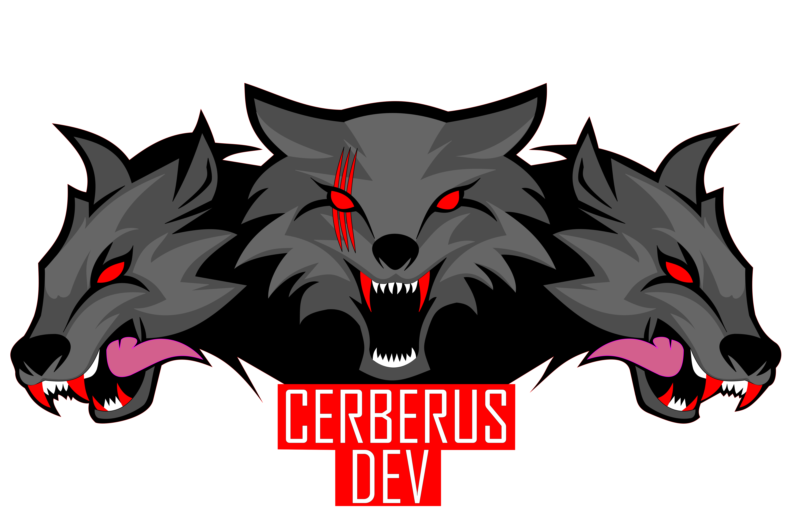

# Conventional Commits Generator

This project is a React application that generates commit messages following the "Conventional Commits" convention. The application supports multiple languages, includes a dark mode, and allows customization of the input fields' order.

## Features

- **Commit Message Generation**: Create standardized commit messages according to the "Conventional Commits" convention.
- **Dark Mode**: Toggle between light and dark modes for a personalized user experience.
- **Multi-language Support**: Switch between English and Portuguese using flags.
- **Reordering Fields**: Customize the order of input fields to generate personalized commit messages.
- **Copy to Clipboard**: Easily copy the generated commit message to the clipboard.

## Technologies Used

- **React**: JavaScript library for building user interfaces.
- **react-i18next**: Library for internationalizing React applications.
- **SortableJS**: Library for reordering elements via drag-and-drop.
- **Bootstrap**: CSS framework for responsive styling.

## Installation

1. **Clone the repository**:

   ```bash
   git clone https://github.com/your-username/conventional-commits-generator.git
   cd conventional-commits-generator
   ```

2. **Install dependencies**:

   ```bash
   npm install
   ```

3. **Start the development server**:

   ```bash
   npm start
   ```

4. **Access the application**:

   Open your browser and go to `http://localhost:3000`.

## Usage

1. **Select Commit Type**: Choose the commit type from the dropdown menu.
2. **Fill in the Fields**: Enter the task identifier and description.
3. **Reorder Fields**: Drag and drop the fields to customize the order of the commit information.
4. **Copy the Message**: Click the copy icon to copy the generated message to the clipboard.
5. **Switch Language**: Click the flags at the top of the page to switch between English and Portuguese.
6. **Dark Mode**: Click the moon/sun icon at the top of the page to toggle between light and dark modes.

## Project Structure

```
conventional-commits-generator/
├── node_modules/
├── public/
├── src/
│   ├── components/
│   │   ├── CommitGenerator.js
│   │   ├── CommitTypeSelect.js
│   │   ├── SortableList.js
│   │   ├── DarkModeToggle.js
│   │   ├── Explanation.js
│   │   └── i18n.js
│   ├── App.js
│   ├── App.css
│   ├── index.js
│   ├── index.css
├── package.json
└── README.md
```

## Developed By

This project was developed by Julie from [DevCerberus](https://devcerberus.com). For more information or support, contact us at: [juliefrancasouza@gmail.com](mailto:juliefrancasouza@gmail.com).

<p align="center">

</p>

## Contribution

Contributions are welcome! Feel free to open issues and pull requests for improvements and fixes.

## References

The concept of **Conventional Commits** used in this project was inspired by [this article](https://medium.com/linkapi-solutions/conventional-commits-pattern-3778d1a1e657) written by Victor Ribeiro, published on October 19, 2020, on *medium.com*.

## License

This project is licensed under the MIT License. See the [LICENSE](LICENSE) file for more details.